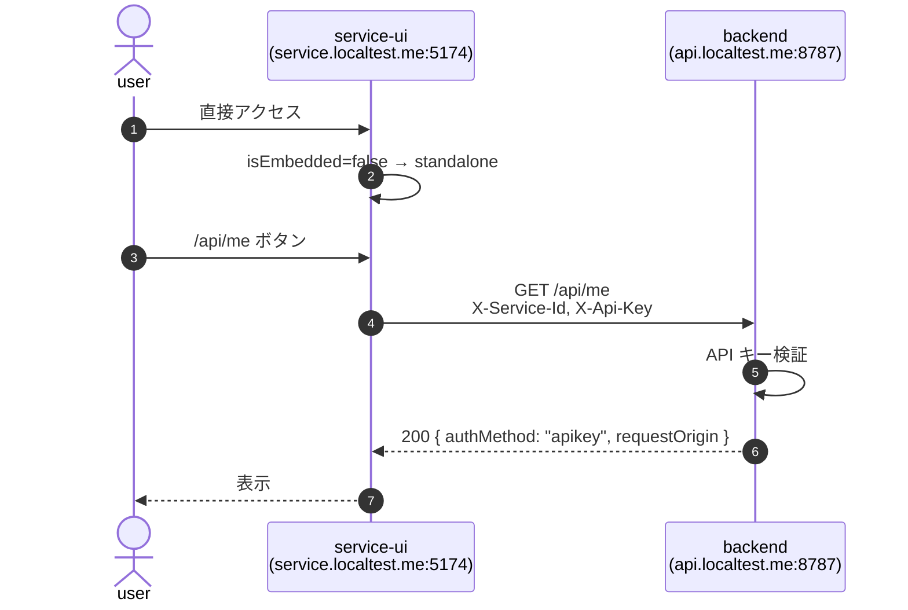
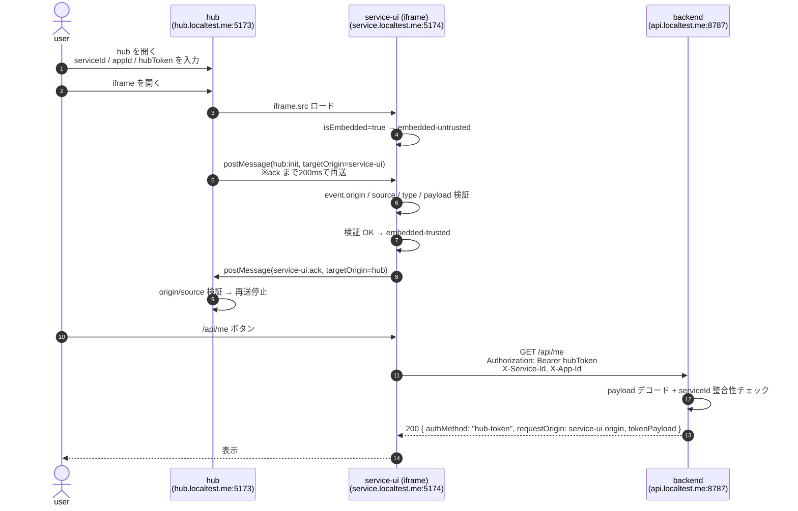

# iframe-test

hub（親）と service-ui（iframe）が `postMessage` で安全に認証情報を受け渡し、
service-ui がその情報で backend（hono）に API リクエストするサンプル。

PLAN.md の実装版。memo.md の 4 つの問いに対する回答は末尾参照。

## 構成

```
apps/
├── backend/      hono + @hono/node-server   (port 8787)
├── service-ui/   react + vite               (port 5174)
└── hub/          react + vite               (port 5173)
```

開発用ホスト名は `*.localtest.me`（DNS が `127.0.0.1` を返す公開サービス）を使い、
`/etc/hosts` を編集せずにクロスオリジン環境を再現する。

| アプリ | URL |
|---|---|
| hub | http://hub.localtest.me:5173 |
| service-ui | http://service.localtest.me:5174 |
| backend | http://api.localtest.me:8787 |

## セットアップ

```sh
pnpm install
pnpm dev   # backend / service-ui / hub を並行起動
```

ブラウザで http://hub.localtest.me:5173 を開く。

## 動作確認シナリオ

### A. standalone（API キー）フロー
1. http://service.localtest.me:5174 を直接開く
2. モード表示が `standalone` になる
3. `/api/me` ボタンで `authMethod: "apikey"` のレスポンスが返る

### B. embedded（hub→iframe）フロー
1. http://hub.localtest.me:5173 を開く
2. `mock トークンを生成` → `iframe を開く`
3. service-ui のモードが `embedded-trusted` に変わる
4. `/api/me` ボタンで `authMethod: "hub-token"` のレスポンスが返る
5. レスポンスの `requestOrigin` が `http://service.localtest.me:5174` であることを確認

### C. 不正な親からの埋め込みを拒否
- service-ui は dev server で `Content-Security-Policy: frame-ancestors` を返すため、
  許可していない親に埋め込まれた場合はブラウザが描画自体をブロックする

### D. 不正な origin からの postMessage を無視
- service-ui の `message` ハンドラは `event.origin` を allowlist 照合し、
  許可されていない origin のメッセージは破棄してログに出す

## シーケンス図

### standalone フロー



### embedded フロー



### Q1. 親から iframe に安全にデータを渡すことは可能？
- **可能**。`postMessage` を使い、`targetOrigin` を **明示**して送信し、受信側で `event.origin` と `event.source` を必ず検証する。
- ただし「安全」はあくまで「許可した親子間でだけ値が伝わる」という意味。**iframe 内 JS が読める値**なので、service-ui 自体が信頼できる前提でないと意味がない。
- このサンプルでは追加で `Content-Security-Policy: frame-ancestors` を返し、許可した親以外による埋め込み自体をブラウザに拒否させている。

### Q2. iframe からバックエンドにアクセストークンをヘッダにセットしてリクエスト送信できる？
- **できる**。iframe 内の `fetch` は通常のクロスオリジンリクエストとして扱われる。`Authorization` 等のカスタムヘッダがあれば preflight が走る。
- このサンプルでは `Authorization: Bearer <hubToken>`、`X-Service-Id`、`X-App-Id` を送信し、backend 側で許可ヘッダに含めている。

### Q3. iframe 経由のリクエストの Origin / CORS は？
- **`Origin` は iframe を表示しているページの origin** になる。親の origin にはならない。
- このサンプルでは `Origin: http://service.localtest.me:5174` が backend に届く。`backend` のレスポンス `requestOrigin` フィールドで実機確認できる。
- したがって CORS 設定は service-ui の origin を許可リストに入れればよく、hub の origin は backend を直叩きしない限り不要。

### Q4. iframe で表示されているページは iframe で実行されているか分かる？
- **`window.self !== window.top` で「埋め込まれているか」は判定できる**。ただし「信頼できる親に埋め込まれているか」は判定できない。
- このサンプルでは状態を 3 つに分けている:
  - `standalone`: 埋め込みでない
  - `embedded-untrusted`: 埋め込まれているが handshake 未完了
  - `embedded-trusted`: 許可 origin から `hub:init` を受け取り検証成功
- 補助情報として Chromium 系のみ `window.location.ancestorOrigins` も読めるが、信頼判定には使わない。

## このサンプルが守れること / 守れないこと

**守れる**
- 許可していない親オリジンからの postMessage を無視する
- 許可していない親に埋め込まれること自体をブラウザに拒否させる（CSP frame-ancestors）
- backend で `serviceId` の整合性を確認する
- トークンを `localStorage` / `sessionStorage` に保存しない（メモリのみ）

**守れない**
- service-ui の JS が侵害されたケース（XSS 等）。トークンはメモリ上で読める
- 「信用できない third-party iframe に秘密を渡す」用途。これは postMessage では本質的に解けない（ブラウザ拡張・別オリジンのプロキシ等の話）

## トラブルシュート

- `localtest.me` が DNS 解決されない場合: 一部の DNS に弾かれることがある。`lvh.me` や `127.0.0.1.nip.io` でも代替可能（環境変数の URL を書き換える）。
- iframe が真っ白で `frame-ancestors` ブロックの場合: 親ページの実 URL を確認。`http://hub.localtest.me:5173` で開くのが基本だが、現在は `http://localhost:5173` と `http://127.0.0.1:5173` も許可している。許可リストを変えたら `service-ui` の dev server 再起動が必要。
- backend のログに `Origin=(none)` が出る場合: ブラウザ以外の curl 等のリクエスト。
